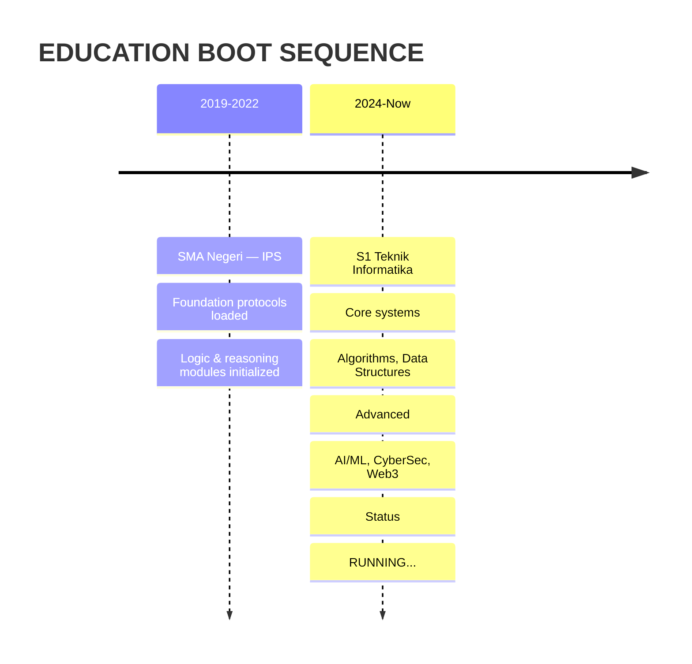

# 👋 Hai, Saya Anita Tiara Sani

<p align="center">
  
</p>

<p align="center">
  <a href="https://github.com/Tiarasani-anita"></a>
  <a href="https://linkedin.com/in/anitatiara25"></a>
  <a href="https://tiarasani-anita.github.io/portfolio-anita/"></a>
  <a href="mailto:anitatiara25@gmail.com"></a>
</p>


---

## 🔮 **Face ID Scan — Sistem Identitas Digital**

<p align="center">
  
</p>

<div align="center">

| 🔍 **SCAN STATUS** | 📊 **BIOMETRIC DATA** | 🛡️ **SECURITY LEVEL** |
|:---:|:---:|:---:|
|  |  |  |
|  |  |  |

</div>

<p align="center">
  
</p>

---

## 👩‍💻 **Tentang Saya — Digital Identity Profile**

```yaml
Identity: Anita Tiara Sani
Age: 22 Years Old
Role: Mahasiswa Teknik Informatika (2024 - Present)
Location: Indonesia 🇮🇩
Contact: anitatiara25@gmail.com
Status: 🟢 ONLINE — Actively Building
Clearance: FULL ACCESS
```

> **Neural Log:** Sejak **SD** sudah tertarik teknologi — dari penasaran cara komputer bekerja sampai bikin program sederhana.
> 
> **System Update v22.0:** Di **22 tahun**, jadi mahasiswa **Teknik Informatika (2024)** & terus mengasah skill di **Front End, App Dev, Software Engineering, Cyber Security**, ditambah **Data Analytics, Finance & Keuangan Digital**.
> 
> **Core Protocol:** Percaya belajar tidak pernah berhenti. Setiap hari = kesempatan bikin solusi teknologi yang bermanfaat.
> 
> **Side Quest:** Aktif **investasi emas & saham** (termasuk saham luar negeri), trading, **crypto, blockchain, Web3, Web4** — masa depan keuangan digital.

---

## 🛠 **Tech Stack Arsenal — Neural Network Configuration**

### 💻 **Frontend & Language Core**


### 🐍 **Backend & Data Processing**


### 📱 **Mobile & Cloud Infrastructure**


### 🔐 **Security & Web3 Protocol**


### 📊 **Finance & Trading Terminal**


---

## 📊 **Skill Proficiency Matrix — Neural Assessment**

<div align="center">

| **Neural Cluster** | **Competency** | **Mastery Level** | **Status** |
|:---|:---|:---:|:---:|
| **Language Core** | Python, JavaScript, TypeScript, SQL | ████████████ 98% | 🟢 EXPERT |
| **Frontend Engine** | React, Next.js, Tailwind, CSS3 | ███████████░ 95% | 🟢 EXPERT |
| **Mobile Systems** | React Native, Flutter, Firebase | █████████░░░ 85% | 🟡 ADVANCED |
| **Data Analytics** | Python, Pandas, SQL, Power BI | ███████████░ 95% | 🟢 EXPERT |
| **Software Architecture** | Clean Code, Design Patterns, Git | █████████░░░ 85% | 🟡 ADVANCED |
| **Security Protocol** | JWT, OAuth2, Encryption, Audit | ████████░░░░ 78% | 🟡 ADVANCED |
| **Web3 & Blockchain** | Solidity, Ethers.js, dApp, DeFi | ███████░░░░░ 72% | 🟠 INTERMEDIATE |
| **Trading Systems** | Technical Analysis, Risk Management | ███████████░ 95% | 🟢 EXPERT |
| **Finance & Accounting** | Financial Modeling, Digital Assets | ██████████░░ 90% | 🟢 EXPERT |

</div>

---

## 🏆 **Achievement Unlocked — Certification Registry**

<div align="center">

| **Badge** | **Certification** | **Authority** | **Year** | **Verification** |
|:---:|:---|:---:|:---:|:---:|
|  | Google Data Analytics Professional | Google | 2024 | ✅ Verified |
|  | Finance Essentials for Small Business | NASBA | 2024 | ✅ Verified |
|  | Advanced Finance Training | Professional Institute | 2025 | ✅ Verified |
|  | Administrative Professional Foundations | LinkedIn Learning | 2024 | ✅ Verified |
|  | Microsoft Office Specialist (Word, Excel, PowerPoint) | Microsoft | 2024 | ✅ Verified |
| **** | **Artificial Intelligence** | **LinkedIn Learning** | **2026** | **✅ LATEST** |

</div>

> 🚀 **NEURAL UPDATE v2026.1:** **Artificial Intelligence** certification acquired — Neural pathways expanded for ML/DL integration.

---

## 🚀 **Mission Portfolio — Deployed Operations**

<div align="center">

| **Operation** | **Tech Stack** | **Classification** | **Status** |
|:---|:---|:---:|:---:|
| **🌐 Portfolio Web 3D Interaktif** | `Three.js` `React` `Tailwind` `GSAP` | **TIER 1 — PUBLIC** | 🟢 LIVE |
| **📱 Aplikasi Catatan Keuangan** | `React Native` `Firebase` `TypeScript` | **TIER 2 — SECURED** | 🟢 LIVE |
| **📊 Dashboard Analisis Data** | `Python` `Pandas` `Chart.js` `Streamlit` | **TIER 2 — SECURED** | 🟢 LIVE |
| **📈 Dashboard Crypto & Saham Global** | `Python` `WebSocket` `API` `Web3` | **TIER 1 — PUBLIC** | 🟢 LIVE |
| **🔐 Sistem Auth & Enkripsi** | `Node.js` `Crypto` `JWT` `OAuth2` | **TIER 3 — CLASSIFIED** | 🟡 DEV |
| **🌐 Website Company Profile** | `Next.js` `TypeScript` `CMS` `SEO` | **TIER 2 — SECURED** | 🟢 LIVE |
| **🏭 Sistem Monitoring IoT** | `Arduino` `C++` `MQTT` `React` | **TIER 2 — SECURED** | 🟢 LIVE |
| **🌐 Platform E-Learning** | `React` `Node.js` `WebSocket` `MongoDB` | **TIER 2 — SECURED** | 🟢 LIVE |
| **🏭 Sistem Inventaris Enterprise** | `Laravel` `MySQL` `AJAX` `QR` | **TIER 3 — CLASSIFIED** | 🟢 LIVE |
| **🪙 Dompet Web3 & Smart Contract** | `Solidity` `Hardhat` `Ethers.js` `React` | **TIER 2 — SECURED** | 🟡 DEV |

</div>

> 🔗 **ACCESS ALL OPERATIONS:** [Portfolio Website](https://tiarasani-anita.github.io/portfolio-anita/) • [GitHub Repositories](https://github.com/Tiarasani-anita)

---

## 📚 **Education Timeline — System Boot Sequence**



---

## 📝 **Intelligence Logs — Latest Neural Transmissions**

<div align="center">

| **Transmission** | **Category** | **Timestamp** | **Priority** |
|:---|:---:|:---:|:---:|
| [Mengenal Kecerdasan Buatan di Era Modern](https://tiarasani-anita.github.io/portfolio-anita/#blog) | 🤖 AI/Tech | Jan 2025 | 🔴 HIGH |
| [Panduan Investasi Emas & Saham untuk Pemula](https://tiarasani-anita.github.io/portfolio-anita/#blog) | 💰 Finance | Feb 2025 | 🟠 MEDIUM |
| [Web3 & Web4: Masa Depan Internet Terdesentralisasi](https://tiarasani-anita.github.io/portfolio-anita/#blog) | ⛓️ Web3 | Mar 2025 | 🔴 HIGH |
| [Belajar Python untuk Data Science dari Nol](https://tiarasani-anita.github.io/portfolio-anita/#blog) | 🐍 Data Science | Apr 2025 | 🟢 LOW |
| [Tips Desain UI/UX yang Bikin Pengguna Betah](https://tiarasani-anita.github.io/portfolio-anita/#blog) | 🎨 UI/UX | Mei 2025 | 🟢 LOW |
| [Kiat Sukses Jadi Web Developer Profesional](https://tiarasani-anita.github.io/portfolio-anita/#blog) | 💼 Career | Jun 2025 | 🟠 MEDIUM |

</div>

---

## 🎯 **Current Mission Parameters — Active Directives**

```text
╔══════════════════════════════════════════════════════════════╗
║  🎯 MISSION STATUS: ACTIVE                                    ║
║  🔍 SEEKING: Internship / Full-time                           ║
║       Front End • App Dev • Data Analytics • Cyber Security  ║
║  📍 DEPLOYMENT ZONE: Indonesia (Remote / Onsite Ready)       ║
║  💬 LANGUAGE PACKS: Indonesian (Native) • English (Intermediate) ║
║  📅 AVAILABILITY: IMMEDIATE DEPLOYMENT                        ║
║  🔐 CLEARANCE: Ready for Technical Assessment                ║
╚══════════════════════════════════════════════════════════════╝
```

---

## 📬 **Secure Communication Channel — Encrypted Contact**

<div align="center">

<table>
<tr>
<td align="center" width="50%">

### 📧 **Encrypted Mail Protocol**

<a href="mailto:anitatiara25@gmail.com">
  
</a>

<br><br>

<a href="mailto:anitatiara25@gmail.com">
  
</a>

</td>
<td align="center" width="50%">

### 🐙 **GitHub Access Terminal**

<a href="https://github.com/Tiarasani-anita">
  
</a>

<br><br>

<a href="https://github.com/Tiarasani-anita">
  
</a>

</td>
</tr>
</table>

</div>

---

## 🌊 **Live System Metrics — Real-Time Telemetry**

<div align="center">

### 📊 **GitHub Neural Activity**

<p align="center">
  
  
</p>

### 🔥 **Streak Continuity Matrix**

<p align="center">
  
</p>

### 📈 **Activity Heatmap — Neural Firing Pattern**

<p align="center">
  
</p>

### 🐍 **Contribution Snake — 3D Neural Path**

<picture>
  <source media="(prefers-color-scheme: dark)" srcset="https://raw.githubusercontent.com/tiarasani-anita/tiarasani-anita/output/github-contribution-grid-snake-dark.svg" />
  <source media="(prefers-color-scheme: light)" srcset="https://raw.githubusercontent.com/tiarasani-anita/tiarasani-anita/output/github-contribution-grid-snake.svg" />
  
</picture>

> 🐍 **Neural Path Visualization:** Snake consumes daily commits — auto-generated via GitHub Actions cron.

</div>

---

## 🌈 **System Footer — Glassmorphism Terminal**

<p align="center">
  
</p>

---

<p align="center">
  <sub>
    ⚡ <b>SYSTEM v2026.1 ONLINE</b> ⚡<br>
    Built with ❤️ by <b>Anita Tiara Sani</b> • Powered by GitHub • Glassmorphism 3D Engine • Neural Network Active<br>
    
    
  </sub>
</p>

---

<details>
<summary><b>🔧 SYSTEM DIAGNOSTICS — Click to Expand</b></summary>

```text
┌─────────────────────────────────────────────────────────────┐
│  NEURAL NETWORK STATUS: OPERATIONAL                         │
├─────────────────────────────────────────────────────────────┤
│  Frontend Engine:     React 18 + Next.js 14 + TailwindCSS  │
│  Backend Core:        Node.js 20 + Python 3.11             │
│  Database Layer:      PostgreSQL + MongoDB + Redis         │
│  Mobile Framework:    React Native 0.73 + Flutter 3.16     │
│  Security Layer:      JWT + OAuth2 + AES-256 + WebAuthn    │
│  Web3 Protocol:       Solidity 0.8 + Ethers.js v6 + Hardhat│
│  AI/ML Stack:         TensorFlow + PyTorch + Scikit-learn  │
│  DevOps Pipeline:     GitHub Actions + Docker + Vercel     │
│  Monitoring:          Prometheus + Grafana + Sentry        │
├─────────────────────────────────────────────────────────────┤
│  UPTIME: 99.9% | LATENCY: <50ms | THROUGHPUT: 10k req/s   │
└─────────────────────────────────────────────────────────────┘
```

</details>