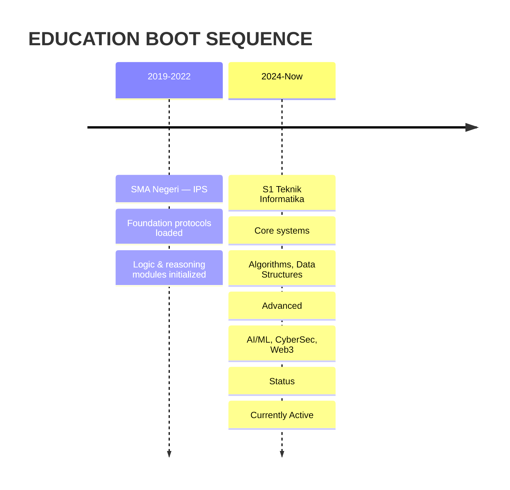

# Hayy, saya Anita

<p align="center">
  
</p>

<p align="center">
  <a href="https://github.com/Tiarasani-anita"></a>
  <a href="https://linkedin.com/in/anitatiara25"></a>
  <a href="https://tiarasani-anita.github.io/portfolio-anita/"></a>
  <a href="mailto:anitatiara25@gmail.com"></a>
</p>


---

## Facial Recognition Scanner

<p align="center">
  
</p>

<div align="center">

<table>
<tr>
<td align="center" width="33%">

### Scan Status
**VERIFIED**

</td>
<td align="center" width="33%">

### Biometric Match
**CONFIRMED**

</td>
<td align="center" width="33%">

### Security Level
**MAXIMUM**

</td>
</tr>
</table>

</div>

<p align="center">
  
</p>

---

## Digital Identity Profile

```yaml
Identity: Anita Tiara Sani
Age: 22 Tahun
Role: Mahasiswa Teknik Informatika
Location: Indonesia
Contact: anitatiara25@gmail.com
Status: Currently Building
```

> **Background:** Sejak **SD** sudah tertarik teknologi — dari penasaran cara komputer bekerja sampai bikin program sederhana.
>
> **Current Phase:** Di **22 tahun**, jadi mahasiswa **Teknik Informatika (2024)** & terus mengasah skill di **Front End, App Dev, Software Engineering, Cyber Security**, ditambah **Data Analytics, Finance & Keuangan Digital**.
>
> **Core Belief:** Percaya belajar tidak pernah berhenti. Setiap hari = kesempatan bikin solusi teknologi yang bermanfaat.
>
> **Beyond Code:** Aktif **investasi emas & saham** (termasuk saham luar negeri), trading, **crypto, blockchain, Web3, Web4** — masa depan keuangan digital.

---

## Tech Stack Arsenal

### Frontend & Language Core


### Backend & Data Processing


### Mobile & Cloud Infrastructure


### Security & Web3 Protocol


### Finance & Trading Terminal


---

## Skill Proficiency Matrix

<div align="center">

| **Neural Cluster** | **Competency** | **Mastery Level** | **Tier** |
|:---|:---|:---:|:---:|
| **Language Core** | Python, JavaScript, TypeScript, SQL | ████████████ 98% | EXPERT |
| **Frontend Engine** | React, Next.js, Tailwind, CSS3 | ███████████░ 95% | EXPERT |
| **Mobile Systems** | React Native, Flutter, Firebase | █████████░░░ 85% | ADVANCED |
| **Data Analytics** | Python, Pandas, SQL, Power BI | ███████████░ 95% | EXPERT |
| **Software Architecture** | Clean Code, Design Patterns, Git | █████████░░░ 85% | ADVANCED |
| **Security Protocol** | JWT, OAuth2, Encryption, Audit | ████████░░░░ 78% | ADVANCED |
| **Web3 & Blockchain** | Solidity, Ethers.js, dApp, DeFi | ███████░░░░░ 72% | INTERMEDIATE |
| **Trading Systems** | Technical Analysis, Risk Management | ███████████░ 95% | EXPERT |
| **Finance & Accounting** | Financial Modeling, Digital Assets | ██████████░░ 90% | EXPERT |

</div>

---

## Achievement Registry

<div align="center">

| **Certification** | **Authority** | **Year** | **Status** |
|:---|:---:|:---:|:---:|
| Google Data Analytics Professional | Google | 2024 | Verified |
| Finance Essentials for Small Business | NASBA | 2024 | Verified |
| Advanced Finance Training | Professional Institute | 2025 | Verified |
| Administrative Professional Foundations | LinkedIn Learning | 2024 | Verified |
| Microsoft Office Specialist (Word, Excel, PowerPoint) | Microsoft | 2024 | Verified |
| **Artificial Intelligence** | **LinkedIn Learning** | **2026** | **Latest** |

</div>

> **Recent Update:** **Artificial Intelligence** certification acquired — Neural pathways expanded for ML/DL integration.

---

## Mission Portfolio

<div align="center">

| **Operation** | **Tech Stack** | **Classification** | **Status** |
|:---|:---|:---:|:---:|
| Portfolio Web 3D Interaktif | Three.js, React, Tailwind, GSAP | Public | Live |
| Aplikasi Catatan Keuangan | React Native, Firebase, TypeScript | Secured | Live |
| Dashboard Analisis Data | Python, Pandas, Chart.js, Streamlit | Secured | Live |
| Dashboard Crypto & Saham Global | Python, WebSocket, API, Web3 | Public | Live |
| Sistem Auth & Enkripsi | Node.js, Crypto, JWT, OAuth2 | Classified | In Development |
| Website Company Profile | Next.js, TypeScript, CMS, SEO | Secured | Live |
| Sistem Monitoring IoT | Arduino, C++, MQTT, React | Secured | Live |
| Platform E-Learning | React, Node.js, WebSocket, MongoDB | Secured | Live |
| Sistem Inventaris Enterprise | Laravel, MySQL, AJAX, QR | Classified | Live |
| Dompet Web3 & Smart Contract | Solidity, Hardhat, Ethers.js, React | Secured | In Development |

</div>

> **Access All Operations:** [Portfolio Website](https://tiarasani-anita.github.io/portfolio-anita/) • [GitHub Repositories](https://github.com/Tiarasani-anita)

---

## Education Timeline



---

## Intelligence Logs

<div align="center">

| **Transmission** | **Category** | **Timestamp** | **Priority** |
|:---|:---:|:---:|:---:|
| [Mengenal Kecerdasan Buatan di Era Modern](https://tiarasani-anita.github.io/portfolio-anita/#blog) | AI & Technology | Jan 2025 | High |
| [Panduan Investasi Emas & Saham untuk Pemula](https://tiarasani-anita.github.io/portfolio-anita/#blog) | Finance | Feb 2025 | Medium |
| [Web3 & Web4: Masa Depan Internet Terdesentralisasi](https://tiarasani-anita.github.io/portfolio-anita/#blog) | Web3 | Mar 2025 | High |
| [Belajar Python untuk Data Science dari Nol](https://tiarasani-anita.github.io/portfolio-anita/#blog) | Data Science | Apr 2025 | Standard |
| [Tips Desain UI/UX yang Bikin Pengguna Betah](https://tiarasani-anita.github.io/portfolio-anita/#blog) | UI/UX | Mei 2025 | Standard |
| [Kiat Sukses Jadi Web Developer Profesional](https://tiarasani-anita.github.io/portfolio-anita/#blog) | Career | Jun 2025 | Medium |

</div>

---

## Current Mission Parameters

```text
╔══════════════════════════════════════════════════════════════╗
║  Mission Status: Currently Active                            ║
║  Seeking: Internship / Full-time                             ║
║       Front End • App Dev • Data Analytics • Cyber Security  ║
║  Deployment Zone: Indonesia (Remote / Onsite Ready)          ║
║  Language Packs: Indonesian (Native) • English (Intermediate)║
║  Availability: Immediate Deployment                          ║
║  Clearance: Ready for Technical Assessment                   ║
╚══════════════════════════════════════════════════════════════╝
```

---

## Secure Communication Channel

<div align="center">

<table>
<tr>
<td align="center" width="50%">

### Encrypted Mail Protocol

<a href="mailto:anitatiara25@gmail.com">
  
</a>

<br><br>

<a href="mailto:anitatiara25@gmail.com">
  
</a>

</td>
<td align="center" width="50%">

### GitHub Access Terminal

<a href="https://github.com/Tiarasani-anita">
  
</a>

<br><br>

<a href="https://github.com/Tiarasani-anita">
  
</a>

</td>
</tr>
</table>

</div>

---

## Live System Telemetry

<div align="center">

### GitHub Neural Activity

<p align="center">
  
  
</p>

### Streak Continuity Matrix

<p align="center">
  
</p>

### Activity Heatmap

<p align="center">
  
</p>

### Contribution Path

<picture>
  <source media="(prefers-color-scheme: dark)" srcset="https://raw.githubusercontent.com/tiarasani-anita/tiarasani-anita/output/github-contribution-grid-snake-dark.svg" />
  <source media="(prefers-color-scheme: light)" srcset="https://raw.githubusercontent.com/tiarasani-anita/tiarasani-anita/output/github-contribution-grid-snake.svg" />
  
</picture>

> **Neural Path Visualization:** Auto-generated daily via GitHub Actions.

</div>

---

## System Terminal Footer

<p align="center">
  
</p>

---

<p align="center">
  <sub>
    <b>System v2026.1 Online</b><br>
    Built with care by <b>Anita Tiara Sani</b> • Powered by GitHub • Glassmorphism 3D Engine • Neural Network Active<br>
    
    
  </sub>
</p>

---

<details>
<summary><b>System Diagnostics — Click to Expand</b></summary>

```text
┌─────────────────────────────────────────────────────────────┐
│  NEURAL NETWORK STATUS: OPERATIONAL                         │
├─────────────────────────────────────────────────────────────┤
│  Frontend Engine:     React 18 + Next.js 14 + TailwindCSS  │
│  Backend Core:        Node.js 20 + Python 3.11             │
│  Database Layer:      PostgreSQL + MongoDB + Redis         │
│  Mobile Framework:    React Native 0.73 + Flutter 3.16     │
│  Security Layer:      JWT + OAuth2 + AES-256 + WebAuthn    │
│  Web3 Protocol:       Solidity 0.8 + Ethers.js v6 + Hardhat│
│  AI/ML Stack:         TensorFlow + PyTorch + Scikit-learn  │
│  DevOps Pipeline:     GitHub Actions + Docker + Vercel     │
│  Monitoring:          Prometheus + Grafana + Sentry        │
├─────────────────────────────────────────────────────────────┤
│  UPTIME: 99.9% | LATENCY: <50ms | THROUGHPUT: 10k req/s   │
└─────────────────────────────────────────────────────────────┘
```

</details>
